Modeling Using Variation
========================

  m51281
  
Modeling Using Variation
========================

  In this section, you will:

Solve direct variation problems.
Solve inverse variation problems.
Solve problems involving joint variation.

  c941f485-13ab-481a-a029-2160ef470707

 
Learning Objectives
===================
Solve a formula for a specific variable (IA 2.3.1).
Solve direct variation problems (IA 7.5.5).
Objective 1: Solve a formula for a specific variable (IA 2.3.1).
================================================================
It is often helpful to *solve a formula for a specific variable.* If you need to put a formula in a spreadsheet, it is not unusual to have to solve it for a specific variable first. We *isolate that variable on one side of the equals sign and all other variables and constants are on the other side of the equal sign.*

Solve the formula $V=\frac{1}{3}\pi {r}^{2}h$ for *h*.

Write the formula.

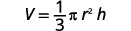

Remove the fraction on the right.

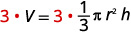

Simplify.

Divide both sides by $\pi {r}^{2}.$ 

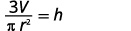

We could now use this formula to find the height of a right circular cone when we know the volume and the radius of the base, by using the formula $h=\frac{3V}{\pi {r}^{2}}.$

Practice Makes Perfect
======================
Solve the given formula for the indicated variable.

  $A=\frac{1}{2}bh$ for *b*

  $F=\frac{9}{5}C+32$ for *C*

  $C=\frac{5}{9}(F-32)$ for *F*

Objective 2: Solve direct variation problems (IA 7.5.5)
=======================================================
Lindsay gets paid $15 per hour at her job. If we let $s$ be her salary and $h$ be the number of hours she has worked, we could model this situation with the equation $S=15h$ .
Lindsay’s salary is the product of a constant, 15, and the number of hours she works. We say that Lindsay’s salary *varies directly* with the number of hours she works. *Two variables vary directly if one is the product of a constant and the other*.
Which graph represents direct variation and why?

ⓐ

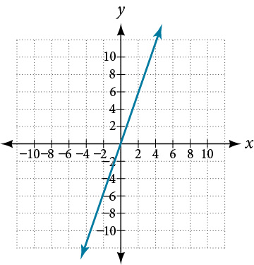

          ⓑ 

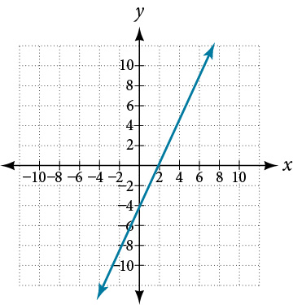

    
Direct Variation
================
For any two variables *x* and *y*, *y* varies directly with *x* if

 $y=kx,\phantom{\rule{0.2em}{0ex}}\text{where}\phantom{\rule{0.2em}{0ex}}k\ne 0$ 
The constant *k* is called the constant of variation.

Solve direct variation problems.

Write the formula for direct variation.
Substitute the given values for the variables.
Solve for the constant of variation.
Write the equation that relates *x* and *y* using the constant of variation.

When Raoul runs on the treadmill at the gym, the number of calories, *c*, he burns varies directly with the number of minutes, *m*, he uses the treadmill. He burned 315 calories when he used the treadmill for 18 minutes.

ⓐ Write the equation that relates *c* and *m*. ⓑ How many calories would he burn if he ran on the treadmill for 25 minutes?

ⓐ

The number of calories, *c*, varies directly withthe number of minutes, *m*, on the treadmill,and $c=315$ when $m=18$ .

Write the formula for direct variation.

We will use *c* in place of *y* and *m* in place of *x*.

Substitute the given values for the variables.

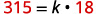

Solve for the constant of variation.

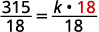

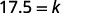

Write the equation that relates *c* and *m*.

Substitute in the constant of variation.

ⓑ

 $\phantom{\rule{0.05em}{0ex}}$ Find *c* when *m* = 25.

Write the equation that relates *c* and *m*. $\phantom{\rule{1.4em}{0ex}}$ 
 $\phantom{\rule{0.1em}{0ex}}$ 

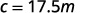

Substitute the given value for *m*.
 $\phantom{\rule{0.1em}{0ex}}$ 

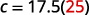

Simplify.
 $\phantom{\rule{0.1em}{0ex}}$ 

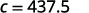

 $\phantom{\rule{0.1em}{0ex}}$ Raoul would burn 437.5 calories if he used the treadmill for 25 minutes.

Practice Makes Perfect
======================

  The number of calories $c$, burned varies directly with the amount of time $t$, spent exercising. Arnold burned 312 calories in 65 minutes exercising. 
          ⓐ Write the equation that relates *c* and *t*.
     
     
          ⓑ How many calories would he burn if he exercises for 90 minutes?

  The distance a moving body travels, $d$, varies directly with the time, $t$, that it moves. A train travels 100 miles in 2 hours.

          ⓐ Write the equation that relates *d* and *t*.
     
     
          ⓑ How many miles would it travel in 5 hours?

  Leland is traveling on a road trip. The distance, $d$, he travels before stopping for lunch varies directly with the speed, $v$, he travels. He can travel 120 miles at a speed of 60 mph.

          ⓐ Write the equation that relates *d* and *v*.
     
     
          ⓑ How far would he travel before stopping for lunch at a rate of 65 mph?
A pre-owned car dealer has just offered their best candidate, Nicole, a position in sales. The position offers 16% commission on her sales. Her earnings depend on the amount of her sales. For instance, if she sells a vehicle for $4,600, she will earn $736. As she considers the offer, she takes into account the typical price of the dealer's cars, the overall market, and how many she can reasonably expect to sell. In this section, we will look at relationships, such as this one, between earnings, sales, and commission rate.

 
Solving Direct Variation Problems
=================================
In the example above, Nicole’s earnings can be found by multiplying her sales by her commission. The formula $e=0.16s$ tells us her earnings, $e,$ come from the product of 0.16, her commission, and the sale price of the vehicle. If we create a table, we observe that as the sales price increases, the earnings increase as well, which should be intuitive. See .

  

    
    
    
     
       $s$ , sales price
       $e=0.16s$
      
      Interpretation 
     
    
    
     
      $4,600
       $e=0.16\left(\mathrm{4,600}\right)=736$
      
      A sale of a $4,600 vehicle results in $736 earnings.
     
     
      $9,200
       $e=0.16\left(\mathrm{9,200}\right)=\mathrm{1,472}$
      
      A sale of a $9,200 vehicle results in $1472 earnings.
     
     
      $18,400
       $e=0.16\left(\mathrm{18,400}\right)=\mathrm{2,944}$
      
      A sale of a $18,400 vehicle results in $2944 earnings.
     
    

Notice that earnings are a multiple of sales. As sales increase, earnings increase in a predictable way. Double the sales of the vehicle from $4,600 to $9,200, and we double the earnings from $736 to $1,472. As the input increases, the output increases as a multiple of the input. A relationship in which one quantity is a constant multiplied by another quantity is called **direct variation**. Each variable in this type of relationship **varies directly** with the other.
represents the data for Nicole’s potential earnings. We say that earnings vary directly with the sales price of the car. The formula $y=k{x}^{n}$ is used for direct variation. The value $k$ is a nonzero constant greater than zero and is called the **constant of variation**. In this case, $k=0.16$ and $n=1.$ We saw functions like this one when we discussed power functions.
\n\n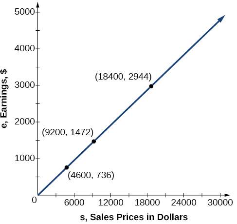\n\n

  
Direct Variation
================

   If $x\phantom{\rule{0.5em}{0ex}}\text{and}\phantom{\rule{0.5em}{0ex}}y$ are related by an equation of the form
 $y=k{x}^{n}$
   
   then we say that the relationship is **direct variation** and $y$
    **varies directly** with, or is proportional to, the $n$th power of $x.$ In direct variation relationships, there is a nonzero constant ratio $k=\frac{y}{{x}^{n}},$ where $k$ is called the **constant of variation**, which help defines the relationship between the variables.

   How To
   *Given a description of a direct variation problem, solve for an unknown.*

   
Identify the input, $x,$ and the output, $y.$
    
    Determine the constant of variation. You may need to divide $y$ by the specified power of $x$ to determine the constant of variation.
   Use the constant of variation to write an equation for the relationship.
    Substitute known values into the equation to find the unknown.
   

  
     
Solving a Direct Variation Problem
==================================

     The quantity $y$ varies directly with the cube of $x.$ If $y=25$ when $x=2,$ find $y$ when $x$ is 6.

    
    
     The general formula for direct variation with a cube is $y=k{x}^{3}.$ The constant can be found by dividing $y$ by the cube of $x.$

 $$
\begin{array}{ccc}\hfill k& =& \frac{y}{{x}^{3}}\hfill \\ & =& \frac{25}{{2}^{3}}\hfill \\ & =& \frac{25}{8}\hfill \end{array}
$$

Now use the constant to write an equation that represents this relationship.

 $$
y=\frac{25}{8}{x}^{3}
$$

Substitute $x=6$ and solve for $y.$

 $$
\begin{array}{ccc}\hfill y& =& \frac{25}{8}{(6)}^{3}\hfill \\ & =& 675\hfill \end{array}
$$ 
    
     
Analysis
========

     The graph of this equation is a simple cubic, as shown in .

     \n\n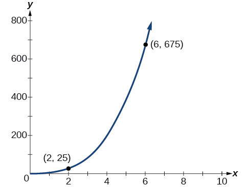\n\n
 
   Q&A
   *Do the graphs of all direct variation equations look like ?*
*No. Direct variation equations are power functions—they may be linear, quadratic, cubic, quartic, radical, etc. But all of the graphs pass through $\left(\mathrm{0,0}\right).$*

   Try It
   
    The quantity $y$ varies directly with the square of $x.$ If $y=24$ when $x=3,$ find $y$ when $x$ is 4.

    $\frac{128}{3}$

   
  
 
Solving Inverse Variation Problems
==================================
Water temperature in an ocean varies inversely to the water’s depth. The formula $T=\frac{\mathrm{14,000}}{d}$ gives us the temperature in degrees Fahrenheit at a depth in feet below Earth’s surface. Consider the Atlantic Ocean, which covers 22% of Earth’s surface. At a certain location, at the depth of 500 feet, the temperature may be 28°F.
If we create , we observe that, as the depth increases, the water temperature decreases.

  

    
    
    
     
       $d,$ depth
       $T=\frac{\text{14,000}}{d}$ 
      Interpretation 
     
    
    
     
      500 ft
       $\frac{\mathrm{14,000}}{500}=28$
      
      At a depth of 500 ft, the water temperature is 28° F.
     
     
      1000 ft
       $\frac{\mathrm{14,000}}{1000}=14$
      
      At a depth of 1,000 ft, the water temperature is 14° F.
     
     
      2000 ft
       $\frac{\mathrm{14,000}}{2000}=7$
      
      At a depth of 2,000 ft, the water temperature is 7° F.
     
    

We notice in the relationship between these variables that, as one quantity increases, the other decreases. The two quantities are said to be *inversely proportional* and each term *varies inversely* with the other. Inversely proportional relationships are also called *inverse variations*.

  For our example,  depicts the **inverse variation**. We say the water temperature varies inversely with the depth of the water because, as the depth increases, the temperature decreases. The formula $y=\frac{k}{x}$ for inverse variation in this case uses $k=\mathrm{14,000.}$
\n\n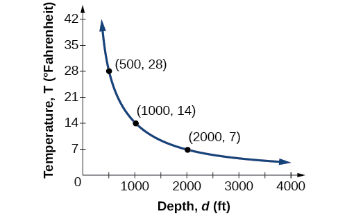\n\n

  
Inverse Variation
=================

   If $x$ and $y$ are related by an equation of the form

    $y=\frac{k}{{x}^{n}}$
where $k$ is a nonzero constant, then we say that $y$ **varies inversely** with the $n\text{th}$ power of $x.$ In **inversely proportional** relationships, or **inverse variations**, there is a constant multiple $k={x}^{n}y.$

   
     
Writing a Formula for an Inversely Proportional Relationship
============================================================

     A tourist plans to drive 100 miles. Find a formula for the time the trip will take as a function of the speed the tourist drives.

    
    
     Recall that multiplying speed by time gives distance. If we let $t$ represent the drive time in hours, and $v$ represent the velocity (speed or rate) at which the tourist drives, then $vt=\text{distance}\text{.}$ Because the distance is fixed at 100 miles, $vt=100$ so $t=\mathrm{100/}v.$ Because time is a function of velocity, we can write $t(v).$

 $$
\begin{array}{ccc}\hfill t(v)& =& \frac{100}{v}\hfill \\ & =& 100{v}^{\mathrm{-1}}\hfill \end{array}
$$

We can see that the constant of variation is 100 and, although we can write the relationship using the negative exponent, it is more common to see it written as a fraction. We say that time varies inversely with velocity.

   
  
   How To
   *Given a description of an indirect variation problem, solve for an unknown.*

   Identify the input, $x,$ and the output, $y.$
    
    Determine the constant of variation. You may need to multiply $y$ by the specified power of $x$ to determine the constant of variation.
   Use the constant of variation to write an equation for the relationship.
   Substitute known values into the equation to find the unknown.
   
   

  
     
Solving an Inverse Variation Problem
====================================

     A quantity $y$ varies inversely with the cube of $x.$ If $y=25$ when $x=2,$ find $y$ when $x$ is 6.

    
    
     The general formula for inverse variation with a cube is $y=\frac{k}{{x}^{3}}.$ The constant can be found by multiplying $y$ by the cube of $x.$

 $$
\begin{array}{ccc}\hfill k& =& {x}^{3}y\hfill \\ & =& {2}^{3}\cdot 25\hfill \\ & =& 200\hfill \end{array}
$$

Now we use the constant to write an equation that represents this relationship.

 $$
\begin{array}{ccc}\hfill y& =& \frac{k}{{x}^{3}},\phantom{\rule{0.5em}{0ex}}\phantom{\rule{0.5em}{0ex}}k=200\hfill \\ y\hfill & =& \frac{200}{{x}^{3}}\hfill \end{array}
$$

     Substitute $x=6$ and solve for $y.$

 $$
\begin{array}{ccc}\hfill y& =& \frac{200}{{6}^{3}}\hfill \\ & =& \frac{25}{27}\hfill \end{array}
$$

    
     
Analysis
========

     The graph of this equation is a rational function, as shown in .
\n\n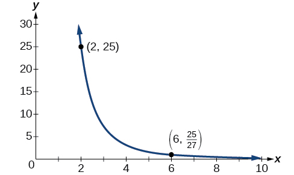\n\n

   
   Try It
   
    A quantity $y$ varies inversely with the square of $x.$ If $y=8$ when $x=3,$ find $y$ when $x$ is 4.

    $\frac{9}{2}$

   
  
 

Solving Problems Involving Joint Variation
==========================================

  Many situations are more complicated than a basic direct variation or inverse variation model. One variable often depends on multiple other variables. When a variable is dependent on the product or quotient of two or more variables, this is called **joint variation**. For example, the cost of busing students for each school trip varies with the number of students attending and the distance from the school. The variable $c,$ cost, varies jointly with the number of students, $n,$ and the distance, $d.$

Joint Variation
===============

Joint variation occurs when a variable varies directly or inversely with multiple variables.
For instance, if $x$ varies directly with both $y$ and $z,$ we have $x=kyz.$ If $x$ varies directly with $y$ and inversely with $z,$ we have $x=\frac{ky}{z}.$ Notice that we only use one constant in a joint variation equation.

Solving Problems Involving Joint Variation
==========================================

 A quantity $x$ varies directly with the square of $y$ and inversely with the cube root of $z.$ If $x=6$ when $y=2$
and $z=8,$ find $x$ when $y=1$ and $z=27.$

Begin by writing an equation to show the relationship between the variables.

 $$
x=\frac{k{y}^{2}}{\sqrt[3]{z}}
$$

Substitute $x=6,$ $y=2,$ and $z=8$ to find the value of the constant $k.$

 $$
\begin{array}{ccc}\hfill 6& =& \frac{k{2}^{2}}{\sqrt[3]{8}}\hfill \\ \hfill 6& =& \frac{4k}{2}\hfill \\ \hfill 3& =& k\hfill \end{array}
$$

Now we can substitute the value of the constant into the equation for the relationship.

 $$
x=\frac{3{y}^{2}}{\sqrt[3]{z}}
$$

 To find $x$ when $y=1$ and $z=27,$ we will substitute values for $y$ and $z$ into our equation.

 $$
\begin{array}{ccc}\hfill x& =& \hfill \frac{3{(1)}^{2}}{\sqrt[3]{27}}\\ & =& 1\hfill \end{array}
$$

 Try It

 A quantity $x$ varies directly with the square of $y$ and inversely with $z.$ If $x=40$ when $y=4$ and $z=2,$ find $x$ when $y=10$
and $z=25.$

 $x=20$

Media
Access these online resources for additional instruction and practice with direct and inverse variation.

 Direct Variation
 Inverse Variation
 Direct and Inverse Variation

Key Equations
=============

Direct variation
 $y=k{x}^{n},\phantom{\rule{0.5em}{0ex}}k$  is a nonzero constant.

Inverse variation
 $y=\frac{k}{{x}^{n}},\phantom{\rule{0.5em}{0ex}}k$ is a nonzero constant.

 
Key Concepts
============

A relationship where one quantity is a constant multiplied by another quantity is called direct variation. See .
Two variables that are directly proportional to one another will have a constant ratio.
 A relationship where one quantity is a constant divided by another quantity is called inverse variation. See .
 Two variables that are inversely proportional to one another will have a constant multiple. See .
 In many problems, a variable varies directly or inversely with multiple variables. We call this type of relationship joint variation. See .

  
Section Exercises
=================

Verbal
======

 
  What is true of the appearance of graphs that reflect a direct variation between two variables?

 

 The graph will have the appearance of a power function.
 

 
  If two variables vary inversely, what will an equation representing their relationship look like?

 

 
  Is there a limit to the number of variables that can vary jointly? Explain.

 No. Multiple variables may jointly vary.

Algebraic
=========
For the following exercises, write an equation describing the relationship of the given variables.

 
  $y$ varies directly as $x$ and when $x=6,y=12.$

 

 
  $y$ varies directly as the square of $x$ and when $x=4,\phantom{\rule{0.5em}{0ex}}y=80\text{.\hspace{0.17em}}$

 $y=5{x}^{2}$

 $y$ varies directly as the square root of $x$ and when $x=36,\phantom{\rule{0.5em}{0ex}}y=24.$

 

 
  $y$ varies directly as the cube of $x$ and when $x=36,\phantom{\rule{0.5em}{0ex}}y=24.$

 $y=\frac{1}{1944}{x}^{3}$

 
  $y$ varies directly as the cube root of $x$ and when $x=27,\phantom{\rule{0.5em}{0ex}}y=15.$

 

 
  
   $y$ varies directly as the fourth power of $x$ and when $x=1,\phantom{\rule{0.5em}{0ex}}y=6.$

  $y=6{x}^{4}$

  

 
  $y$ varies inversely as $x$ and when $x=4,\phantom{\rule{0.5em}{0ex}}y=2.$

 
  $y$ varies inversely as the square of $x$ and when $x=3,\phantom{\rule{0.5em}{0ex}}y=2.$

 $y=\frac{18}{{x}^{2}}$

 
  $y$ varies inversely as the cube of $x$ and when $x=2,\phantom{\rule{0.5em}{0ex}}y=5.$

$y$ varies inversely as the fourth power of $x$ and when $x=3,\phantom{\rule{0.5em}{0ex}}y=1.$

  $y=\frac{81}{{x}^{4}}$

 
  $y$ varies inversely as the square root of $x$ and when $x=25,\phantom{\rule{0.5em}{0ex}}y=3.$

 
  $y$ varies inversely as the cube root of $x$ and when $x=64,\phantom{\rule{0.5em}{0ex}}y=5.$

 $y=\frac{20}{\sqrt[3]{x}}$

 
  $y$ varies jointly with $x$ and $z$ and when $x=2$ and $z=3,\phantom{\rule{0.5em}{0ex}}y=36.$

 
  $y$ varies jointly as $x,z,$ and $w$ and when $x=1,\phantom{\rule{0.5em}{0ex}}z=2,\phantom{\rule{0.5em}{0ex}}w=5,$ then $y=100.$

 $y=10xzw$

 
  $y$ varies jointly as the square of $x$ and the square of $z$ and when $x=3$ and $z=4,$ then $y=72.$

 
  $y$ varies jointly as $x$ and the square root of $z$ and when $x=2$ and $z=25,$ then $y=100.$

 $y=10x\sqrt{z}$

 
  $y$ varies jointly as the square of $x$ the cube of $z$ and the square root of $W.$ When $x=1,z=2,$ and $w=36,$ then $y=48.$

 
  $y$
   varies jointly as $x$ and $z$ and inversely as $w$. When $x=3,\phantom{\rule{0.5em}{0ex}}z=5$, and $w=6$, then $y=10.$

 $y=4\frac{xz}{w}$

$y$ varies jointly as the square of $x$ and the square root of $z$ and inversely as the cube of $w\text{.\hspace{0.17em}}$ When $x=3,z=4,$ and $w=3,$ then $y=6.$

  $y$ varies jointly as $x$ and $z$ and inversely as the square root of $w$ and the square of $t\text{.}$ When $x=3,z=1,w=25,$ and $t=2,$ then $y=6.$

$y=40\frac{xz}{\sqrt{w}{t}^{2}}$

Numeric
=======
For the following exercises, use the given information to find the unknown value.

 
  
   $y$ varies directly as $x.$ When $x=3,$ then $y=12.$ Find $y$ wneh $x=20.$

 

 
  $y$ varies directly as the square of $x.$ When $x=2,$ then $y=16.$ Find $y$ when $x=8.$

 $y=256$

 
  $y$ varies directly as the cube of $x.$ When $x=3,$ then $y=5.$ Find $y$ when $x=4.$

 
  $y$ varies directly as the square root of $x.$ When $x=16,$ then $y=4.$ Find $y$ when $x=36.$

 $y=6$

 
  $y$ varies directly as the cube root of $x.$ When $x=125,$ then $y=15.$ Find $y$ when $x=\mathrm{1,000.}$

 
  $y$ varies inversely with $x.$ When $x=3,$ then $y=2.$ Find $y$ when $x=1.$

 $y=6$

 
  $y$ varies inversely with the square of $x.$ When $x=4,$ then $y=3.$ Find $y$ when $x=2.$

 
  $y$ varies inversely with the cube of $x.$ When $x=3,$ then $y=1.$ Find $y$ when $x=1.$

 $y=27$

 
  $y$ varies inversely with the square root of $x.$ When $x=64,$ then $y=12.$ Find $y$ when $x=36.$

 
  $y$ varies inversely with the cube root of $x.$ When $x=27,$ then $y=5.$ Find $y$ when $x=125.$

 $y=3$

 
  $y$ varies jointly as $x\text{and}z.$ When $x=4$ and $z=2,$ then $y=16.$ Find $y$ when $x=3$ and $z=3.$

 
  $y$ varies jointly as $x,z,\text{and}w.$ When $x=2,$ $z=1,$ and $w=12,$ then $y=72.$ Find $y$ when $x=1,$ $z=2,$
   and $w=3.$

 $y=18$

 
  $y$ varies jointly as $x$ and the square of $\mathrm{z.}$ When $x=2$ and $z=4,$ then $y=144.$ Find $y$ when $x=4$ and $z=5.$

 
  $y$ varies jointly as the square of $x$ and the square root of $z.$ When $x=2$ and $z=9,$ then $y=24.$ Find $y$ when $x=3$ and $z=25.$

 $y=90$

 
  $y$ varies jointly as $x$ and $z$ and inversely as $w.$ When $x=5,$ $z=2,$ and $w=20,$ then $y=4.$ Find $y$ when $x=3$ and $z=8,$ and $w=48.$

 
  $y$ varies jointly as the square of $x$ and the cube of $z$ and inversely as the square root of $w\text{.\hspace{0.17em}}$ When $x=2,$ $z=2,$ and $w=64,$ then $y=12.$ Find $y$ when $x=1,$ $z=3,$ and $w=4.$

 

 $y=\frac{81}{2}$

 
  $y$ varies jointly as the square of $x$ and of $z$ and inversely as the square root of $w$ and of $t\text{.}$ When $x=2,$ $z=3,$ $w=16,$ and $t=3,$ then $y=1.$ Find $y$ when $x=3,$ $z=2,$ $w=36,$ and $t=5.$

Technology
==========
For the following exercises, use a calculator to graph the equation implied by the given variation.

  $y$ varies directly with the square of $x$ and when $x=2,y=3.$

 
  $y=\frac{3}{4}{x}^{2}$

 

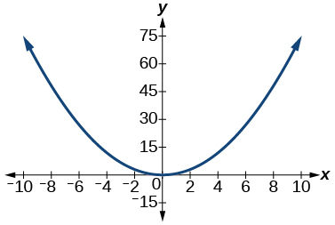

 
 
  $y$ varies directly as the cube of $x$ and when $x=2,y=4.$

  $y$ varies directly as the square root of $x$ and when $x=36,y=2.$

 $y=\frac{1}{3}\sqrt{x}$

 

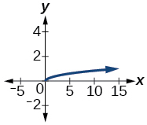

 
  $y$ varies inversely with $x$ and when $x=6,y=2.$

 
   $y$ varies inversely as the square of $x$ and when $x=1,y=4.$

  $y=\frac{4}{{x}^{2}}$

 

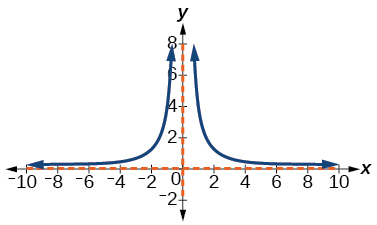

Extensions
==========
For the following exercises, use Kepler’s Law, which states that the square of the time, $T,$ required for a planet to orbit the Sun varies directly with the cube of the mean distance, $a,$ that the planet is from the Sun.

 
  Using Earth’s time of 1 year and mean distance of 93 million miles, find the equation relating
 $T$
and
 $a.$

 
  Use the result from the previous exercise to determine the time required for Mars to orbit the Sun if its mean distance is 142 million miles.

 

 1.89 years

 
  Using Earth’s distance of 150 million kilometers, find the equation relating $T$ and $a.$

 
  Use the result from the previous exercise to determine the time required for Venus to orbit the Sun if its mean distance is 108 million kilometers.

 

 0.61 years

 
  Using Earth’s distance of 1 astronomical unit (A.U.), determine the time for Saturn to orbit the Sun if its mean distance is 9.54 A.U.

 

Real-World Applications
=======================

For the following exercises, use the given information to answer the questions.

 
  The distance $s$ that an object falls varies directly with the square of the time, $t,$ of the fall. If an object falls 16 feet in one se*c*ond, how long for it to fall 144 feet?

 

 3 seconds

 
  The velocity $v$ of a falling object varies directly to the time, $t$, of the fall. If after 2 seconds, the velocity of the object is 64 feet per second, what is the velocity after 5 seconds?

 
  The rate of vibration of a string under constant tension varies inversely with the length of the string. If a string is 24 inches long and vibrates 128 times per second, what is the length of a string that vibrates 64 times per second?

 48 inches

 
  The volume of a gas held at constant temperature varies indirectly as the pressure of the gas. If the volume of a gas is 1200 cubic centimeters when the pressure is 200 millimeters of mercury, what is the volume when the pressure is 300 millimeters of mercury?

 

 
  The weight of an object above the surface of Earth varies inversely with the square of the distance from the center of Earth. If a body weighs 50 pounds when it is 3960 miles from Earth’s center, what would it weigh it were 3970 miles from Earth’s center?

 49.75 pounds

 
  The intensity of light measured in foot-candles varies inversely with the square of the distance from the light source. Suppose the intensity of a light bulb is 0.08 foot-candles at a distance of 3 meters. Find the intensity level at 8 meters.

 

 
  The current in a circuit varies inversely with its resistance measured in ohms. When the current in a circuit is 40 amperes, the resistance is 10 ohms. Find the current if the resistance is 12 ohms.

 

 33.33 amperes

 
  The force exerted by the wind on a plane surface varies jointly with the square of the velocity of the wind and with the area of the plane surface. If the area of the surface is 40 square feet surface and the wind velocity is 20 miles per hour, the resulting force is 15 pounds. Find the force on a surface of 65 square feet with a velocity of 30 miles per hour.

 

The horsepower (hp) that a shaft can safely transmit varies jointly with its speed (in revolutions per minute (rpm) and the cube of the diameter. If the shaft of a certain material 3 inches in diameter can transmit 45 hp at 100 rpm, what must the diameter be in order to transmit 60 hp at 150 rpm?

 2.88 inches

 
  The kinetic energy $K$ of a moving object varies jointly with its mass $m$ and the square of its velocity $v.$ If an object weighing 40 kilograms with a velocity of 15 meters per second has a kinetic energy of 1000 joules, find the kinetic energy if the velocity is increased to 20 meters per second.

 

  

Chapter Review Exercises
========================

Quadratic Functions
===================
For the following exercises, write the quadratic function in standard form. Then give the vertex and axes intercepts. Finally, graph the function.

  $f(x)={x}^{2}-4x-5$

 
 
$f(x)={(x-2)}^{2}-9\phantom{\rule{0.5em}{0ex}}\text{vertex}\ (2,\mathrm{\u20139}),\ \text{intercepts}\ (5,0);\ (\mathrm{\u20131},0);\ (0,\mathrm{\u20135})$
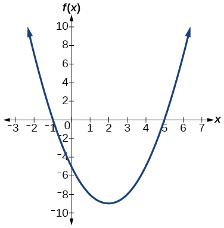

 
  $f(x)=-2{x}^{2}-4x$

 

For the following exercises, find the equation of the quadratic function using the given information.

 
  The vertex is $(\u20132,3)$ and a point on the graph is $(3,6).$

 

 $f(x)=\frac{3}{25}{\left(x+2\right)}^{2}+3$

 
  The vertex is $(\u20133,6.5)$ and a point on the graph is $(2,6).$

 

For the following exercises, complete the task.

 
  A rectangular plot of land is to be enclosed by fencing. One side is along a river and so needs no fence. If the total fencing available is 600 meters, find the dimensions of the plot to have maximum area.

 

 300 meters by 150 meters, the longer side parallel to river.
 

 
  An object projected from the ground at a 45 degree angle with initial velocity of 120 feet per second has height, $h,$ in terms of horizontal distance traveled, $x,$ given by $h(x)=\frac{-32}{{(120)}^{2}}{x}^{2}+x.$ Find the maximum height the object attains.

Power Functions and Polynomial Functions
========================================
For the following exercises, determine if the function is a polynomial function and, if so, give the degree and leading coefficient.

 
  $f(x)=4{x}^{5}-3{x}^{3}+2x-1$

 

Yes, degree = 5, leading coefficient = 4

 
  $f(x)={5}^{x+1}-{x}^{2}$

 

 
  $f(x)={x}^{2}\left(3-6x+{x}^{2}\right)$

 
 Yes, degree = 4, leading coefficient = 1

For the following exercises, determine end behavior of the polynomial function.

 
  $f(x)=2{x}^{4}+3{x}^{3}-5{x}^{2}+7$

 

 
  $f(x)=4{x}^{3}-6{x}^{2}+2$

 

 $\text{As}\phantom{\rule{0.5em}{0ex}}x\to -\infty ,\phantom{\rule{0.5em}{0ex}}f(x)\to -\infty ,\phantom{\rule{0.5em}{0ex}}\text{as}\phantom{\rule{0.5em}{0ex}}x\to \infty ,\phantom{\rule{0.5em}{0ex}}f(x)\to \infty$

     $f(x)=2{x}^{2}(1+3x-{x}^{2})$

 
Graphs of Polynomial Functions
==============================
For the following exercises, find all zeros of the polynomial function, noting multiplicities.

 $f(x)={(x+3)}^{2}(2x-1){(x+1)}^{3}$

  –3 with multiplicity 2, $-\frac{1}{2}$ with multiplicity 1, –1 with multiplicity 3

 
  
   $f(x)={x}^{5}+4{x}^{4}+4{x}^{3}$

  
 

 
  $f(x)={x}^{3}-4{x}^{2}+x-4$

 

 4 with multiplicity 1

For the following exercises, based on the given graph, determine the zeros of the function and note multiplicity.

   

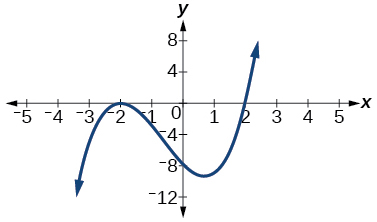

 

   

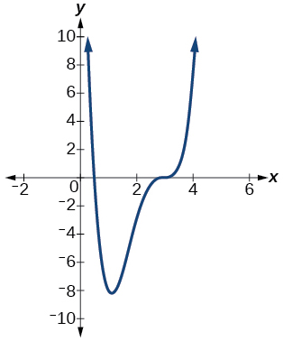

 

 $\frac{1}{2}$ with multiplicity 1, 3 with multiplicity 3

 
  Use the Intermediate Value Theorem to show that at least one zero lies between 2 and 3 for the function $f(x)={x}^{3}-5x+1$

 

Dividing Polynomials
====================
For the following exercises, use long division to find the quotient and remainder.

 
  $\frac{{x}^{3}-2{x}^{2}+4x+4}{x-2}$

 

 ${x}^{2}+4$ with remainder 12

 
  $\frac{3{x}^{4}-4{x}^{2}+4x+8}{x+1}$

 

For the following exercises, use synthetic division to find the quotient. If the divisor is a factor, then write the factored form.

 
  $\frac{{x}^{3}-2{x}^{2}+5x-1}{x+3}$

 
 
  ${x}^{2}-5x+20-\frac{61}{x+3}$

 

 
  $\frac{{x}^{3}+4x+10}{x-3}$

 

 
  $\frac{2{x}^{3}+6{x}^{2}-11x-12}{x+4}$

 

 $2{x}^{2}-2x-3$ , so factored form is $(x+4)(2{x}^{2}-2x-3)$

 $\frac{3{x}^{4}+3{x}^{3}+2x+2}{x+1}$

Zeros of Polynomial Functions
=============================
For the following exercises, use the Rational Zero Theorem to help you solve the polynomial equation.

 
  $2{x}^{3}-3{x}^{2}-18x-8=0$

 

 $\left\{-2,\ 4,\ -\frac{1}{2}\right\}$

 
  $3{x}^{3}+11{x}^{2}+8x-4=0$

 

 
  $2{x}^{4}-17{x}^{3}+46{x}^{2}-43x+12=0$

 

 $\left\{1,\ 3,\ 4,\ \frac{1}{2}\right\}$

 
  $4{x}^{4}+8{x}^{3}+19{x}^{2}+32x+12=0$

 

For the following exercises, use Descartes’ Rule of Signs to find the possible number of positive and negative solutions.

 
  ${x}^{3}-3{x}^{2}-2x+4=0$

 

 0 or 2 positive, 1 negative

 
  $2{x}^{4}-{x}^{3}+4{x}^{2}-5x+1=0$

 

 
Rational Functions
==================
For the following exercises, find the intercepts and the vertical and horizontal asymptotes, and then use them to sketch a graph of the function.

  $f(x)=\frac{x+2}{x-5}$

 
  Intercepts $(\mathrm{\u20132},0)\text{and}\left(0,-\frac{2}{5}\right)$ , Asymptotes $x=5$
  and $y=1.$
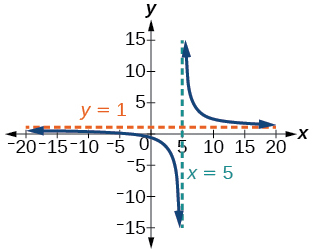

 
  $f(x)=\frac{{x}^{2}+1}{{x}^{2}-4}$

 

  $f(x)=\frac{3{x}^{2}-27}{{x}^{2}+x-2}$

 

 Intercepts (3, 0), (-3, 0), and $\left(0,\frac{27}{2}\right)$,  Asymptotes $x=1,\ x=\u20132,\ y=3.$
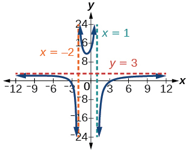

 
  $f(x)=\frac{x+2}{{x}^{2}-9}$

For the following exercises, find the slant asymptote.

 
  $f(x)=\frac{{x}^{2}-1}{x+2}$

 

 $y=\phantom{\rule{0.5em}{0ex}}\text{}x-2$

 
  $f(x)=\frac{2{x}^{3}-{x}^{2}+4}{{x}^{2}+1}$

 

Inverses and Radical Functions
==============================
For the following exercises, find the inverse of the function with the domain given.

 
  $f(x)={(x-2)}^{2},\phantom{\rule{0.5em}{0ex}}x\ge 2$

 

 ${f}^{-1}(x)=\sqrt{x}+2$

 
  $f(x)={(x+4)}^{2}-3,\phantom{\rule{0.5em}{0ex}}x\ge -4$

 

 
  
   $f(x)={x}^{2}+6x-2,\phantom{\rule{0.5em}{0ex}}x\ge -3$

  
  
   ${f}^{-1}(x)=\sqrt{x+11}-3$

  
 
 
  
   $f(x)=2{x}^{3}-3$

  
 
 
  
   $f(x)=\sqrt{4x+5}-3$

  
  
   ${f}^{-1}(x)=\frac{{(x+3)}^{2}-5}{4},\phantom{\rule{0.5em}{0ex}}x\ge -3$

  
 
 
  
   $f(x)=\frac{x-3}{2x+1}$

  
 

Modeling Using Variation
========================
For the following exercises, find the unknown value.

     
      
       $y$
         varies directly as the square of $x.$
         If when $x=3,\phantom{\rule{0.5em}{0ex}}\text{}y=36,$ find $y$ if $x=4.$

      
       $y=64$

      
     
     
      
       $y$
         varies inversely as the square root of $x$
         If when $x=25,\phantom{\rule{0.5em}{0ex}}\text{}y=2,$ find $y$ if $x=4.$

     
     
      
       $y$ varies jointly as the cube of $x$ and as $z.$ If when $x=1$ and $z=2,$ $y=6,$ find $y$ if $x=2$ and $z=3.$

      
       $y\phantom{\rule{0.5em}{0ex}}\text{}=\phantom{\rule{0.5em}{0ex}}\text{}72$

      
     
     
      
       $y$ varies jointly as $x$ and the square of $z$ and inversely as the cube of $w.$ If when $x=3,$ $z=4,$ and $w=2,$ $y=48,$ find $y$ if $x=4,$ $z=5,$ and $w=3.$

     

     For the following exercises, solve the application problem.

     
      
       The weight of an object above the surface of the earth varies inversely with the square of the distance from the center of the earth. If a person weighs 150 pounds when he is on the surface of the earth (3,960 miles from center), find the weight of the person if he is 20 miles above the surface.

      
      
       148.5 pounds

      
     
     
      
       The volume $V$ of an ideal gas varies directly with the temperature $T$ and inversely with the pressure P. A cylinder contains oxygen at a temperature of 310 degrees K and a pressure of 18 atmospheres in a volume of 120 liters. Find the pressure if the volume is decreased to 100 liters and the temperature is increased to 320 degrees K.

     
    
Chapter Test
============
Give the degree and leading coefficient of the following polynomial function.

   
     $f(x)={x}^{3}\left(3-6x-2{x}^{2}\right)$

    
   
Degree: 5, leading coefficient: −2

Determine the end behavior of the polynomial function.

  
    $f(x)=8{x}^{3}-3{x}^{2}+2x-4$

   
   
  
     $f(x)=-2{x}^{2}(4-3x-5{x}^{2})$

    
   
$\text{As}x\to \mathrm{-\infty},f\left(x\right)\to \mathrm{\infty},\text{As}x\to \mathrm{\infty},f\left(x\right)\to \mathrm{\infty}$
Write the quadratic function in standard form. Determine the vertex and axes intercepts and graph the function.

   
     $f(x)={x}^{2}+2x-8$

    
   Given information about the graph of a quadratic function, find its equation.

   
     Vertex $(2,0)$ and point on graph $(4,12).$

$f(x)=3{(x-2)}^{2}$

   Solve the following application problem.

   
     A rectangular field is to be enclosed by fencing. In addition to the enclosing fence, another fence is to divide the field into two parts, running parallel to two sides. If 1,200 feet of fencing is available, find the maximum area that can be enclosed.

    
   Find all zeros of the following polynomial functions, noting multiplicities.

   
     $f(x)={(x-3)}^{3}(3x-1){(x-1)}^{2}$

    

3 with multiplicity 3, $\frac{1}{3}$ with multiplicity 1, 1 with multiplicity 2

     $f(x)=2{x}^{6}-12{x}^{5}+18{x}^{4}$

  
   Based on the graph, determine the zeros of the function and multiplicities.

   

    

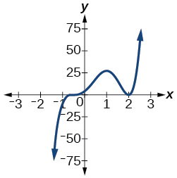

    
   
$-\frac{1}{2}$ with multiplicity 3, 2 with multiplicity 2
Use long division to find the quotient.

   
     $\frac{2{x}^{3}+3x-4}{x+2}$

    
   
   Use synthetic division to find the quotient. If the divisor is a factor, write the factored form.

   
     $\frac{{x}^{4}+3{x}^{2}-4}{x-2}$

    
   
${x}^{3}+2{x}^{2}+7x+14+\frac{24}{x-2}$

     $\frac{2{x}^{3}+5{x}^{2}-7x-12}{x+3}$

    
   
   Use the Rational Zero Theorem to help you find the zeros of the polynomial functions.

   
     $f(x)=2{x}^{3}+5{x}^{2}-6x-9$

    
   
$\left\{\mathrm{\u20133},\mathrm{\u20131},\frac{3}{2}\right\}$

     $f(x)=4{x}^{4}+8{x}^{3}+21{x}^{2}+17x+4$

    
   
   
     $f(x)=4{x}^{4}+16{x}^{3}+13{x}^{2}-15x-18$

    
   
1, −2, and − $\frac{3}{2}$ (multiplicity 2)

     $f(x)={x}^{5}+6{x}^{4}+13{x}^{3}+14{x}^{2}+12x+8$

    
   
   Given the following information about a polynomial function, find the function.

   
     It has a double zero at $x=3$ and zeros at $x=1$ and $x=-2$ . Its *y*-intercept is $(0,12).$

$f(x)=-\frac{2}{3}{(x-3)}^{2}(x-1)(x+2)$

   
     It has a zero of multiplicity 3 at $x=\frac{1}{2}$ and another zero at $x=-3$ . It contains the point $(1,8).$

   
   Use Descartes’ Rule of Signs to determine the possible number of positive and negative solutions.

  $8{x}^{3}-21{x}^{2}+6=0$

 

2 or 0 positive, 1 negative

For the following rational functions, find the intercepts and horizontal and vertical asymptotes, and sketch a graph.

   
     $f(x)=\frac{x+4}{{x}^{2}-2x-3}$

    
  
   
     $f(x)=\frac{{x}^{2}+2x-3}{{x}^{2}-4}$

    
   
$(-3,0)(1,0)\left(0,\frac{3}{4}\right)$

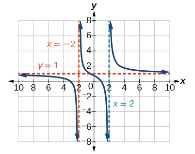
Find the slant asymptote of the rational function.

   
     $f(x)=\frac{{x}^{2}+3x-3}{x-1}$

    
   
   Find the inverse of the function.

   
     $f(x)=\sqrt{x-2}+4$

    
   
${f}^{-1}(x)={(x-4)}^{2}+2,x\ge 4$

     $f(x)=3{x}^{3}-4$

    
   
   
     $f(x)=\frac{2x+3}{3x-1}$

    
   
${f}^{-1}(x)=\frac{x+3}{3x-2}$
Find the unknown value.

   
     $y$ varies inversely as the square of $x$ and when $x=3,$ $y=2.$ Find $y$ if $x=1.$

   
   
     $y$ varies jointly with $x$ and the cube root of $z.$ If when $x=2$ and $z=27,$ $y=12,$ find $y$ if $x=5$ and $z=8.$

   
$y=20$

Solve the following application problem.

   
     The distance a body falls varies directly as the square of the time it falls. If an object falls 64 feet in 2 seconds, how long will it take to fall 256 feet?

    
  
 
  
   **constant of variation**
   the non-zero value $k$
that helps define the relationship between variables in direct or inverse variation
  
   **direct variation**
   the relationship between two variables that are a constant multiple of each other; as one quantity increases, so does the other
  
   **inverse variation**
   the relationship between two variables in which the product of the variables is a constant
  
   **inversely proportional**
   a relationship where one quantity is a constant divided by the other quantity; as one quantity increases, the other decreases
  
   **joint variation**
   a relationship where a variable varies directly or inversely with multiple variables
  
   **varies directly**
   a relationship where one quantity is a constant multiplied by the other quantity
  
   **varies inversely**
   a relationship where one quantity is a constant divided by the other quantity
